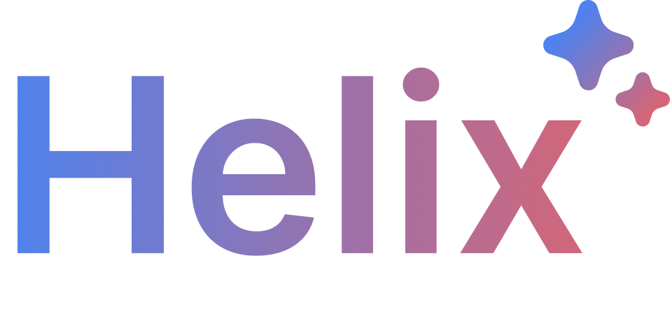

# Helix - Chrome Extension for Automated Userscript Generation

## Overview

Helix is a Chrome extension that makes use of the Gemini API to automatically generate userscripts based on user prompts.

## Requirements

-   **Gemini API Key**: You will need a Gemini API key. Obtain your key by signing up for the Gemini API service.
-   **System Prompt**: Populate the system prompt with the included prompt found in data/system_prompt.md

## Installation

### 1. Clone the Repository

Clone this repository to your local machine using the following command:

```bash
git clone https://github.com/hfx6/helix.git
```

### 2. Load the Extension in Chrome

1. Open Chrome and navigate to `chrome://extensions/`.
2. Enable "Developer mode" using the toggle in the top-right corner.
3. Click on "Load unpacked" and select the directory where you cloned the repository.

### 3. Configure the Extension

1. Open the settings and populate the fields with your information

### 4. Using the Extension

1. Click on the Helix icon in your Chrome toolbar to open the popup interface.
2. Enter your prompt describing the result you want e.g. "Add a button that scrolls to the top".
3. Helix will process your input and generate the corresponding userscript using the Gemini API.
4. The script will be injected and executed on the active web page after you click run, or autoimatically if auto run is selected.
5. Don't like a script Helix has made? tell it the issues and it will iterate over them!

## Loading states:
### Active:
Helix is reading to take commands


### Loading:
Helix is processing a request in the background


### Active:
A script is active on this page


### Autorun:
A script is active on this page with the total count


## Troubleshooting

1. **The request won't load, and the loading animation doesn't show:**
- Sometimes while editing the background script, The state will become stale and the active tab's will become unknown. close and reopen to fix this

2. **I can't acces Gemini 1.5 pro**
- Make sure that you have billing enabled in order to use Gemini pro (even the free tier).

3. **The script didn't do anything:**
- Sometimes a script will fail, If this happens try asking Helix to fix it.

4. **A script isnt showing up on the right page:**
- The url matching is based on the most recent response, ask Helix to change the response and it will be changed.
